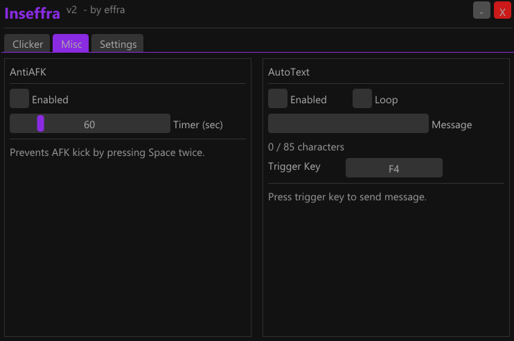
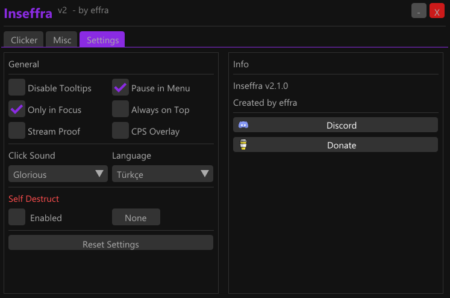

# 🎮 Inseffra

### Advanced Minecraft Macro Tool for PvP

**[⬇️ Download](https://github.com/inseffra/inseffra/releases/latest) • [📖 Features](#-features) • [🚀 Installation](#-installation)**

---

*A lightweight, undetectable macro tool designed for Minecraft PvP.*

---

## ✨ Features

<table>
<tr>
<td width="50%">

### 🖱️ Left Clicker
- Adjustable CPS (1-40)
- Smart Randomization
- Blockhit Support
- Mouse Shake
- Multiple Click Patterns
- Break Blocks Mode

</td>
<td width="50%">

### 🖱️ Right Clicker
- Fast Bridging
- Allow Eating Mode
- Customizable CPS
- Hold Mode Support

</td>
</tr>
<tr>
<td>

### 🛡️ Safety Features
- 👻 Stream Proof
- Pause in Menu
- Only in Focus Mode

</td>
<td>

### ⚙️ Advanced
- 🔊 Click Sounds (7 mice)
- 🌍 Multi-Language (EN/TR)
- ⌨️ Custom Hotkeys
- Anti-AFK System

</td>
</tr>
</table>

---

## 👻 Stream Proof

Stay safe during screen shares! Inseffra is **completely invisible** to:

| Application | Hidden? |
|-------------|---------|
| Discord Screen Share | ✅ Yes |
| OBS Studio | ✅ Yes |
| Windows Game Bar | ✅ Yes |
| Zoom / Teams | ✅ Yes |
| AnyDesk / TeamViewer | ✅ Yes |

---

## 🎯 Tested Servers

| Server | Status |
|--------|--------|
| Craftrise | ✅ Tested |
| Sonoyuncu | ✅ Tested |
| Hypixel | ⚠️ Use carefully |
| Lunar Client | ✅ Works |
| Badlion Client | ✅ Works |
| Vanilla | ✅ Works |

---

## 🚀 Installation

1. Download the latest version from [**Releases**](https://github.com/inseffra/inseffra/releases/latest)
2. Extract the ZIP file
3. Run `Inseffra.exe`
4. Configure and enjoy!

> ⚠️ **Windows Defender:** May show false positive. Click "More info" → "Run anyway" or add an exception.

---

## 📸 Screenshots

---

## 🔊 Click Sounds

Realistic mouse click sounds to mask macro usage in recordings:

- Logitech G303
- Logitech G502  
- Logitech G Pro
- Bloody
- Razer
- Glorious
- Zowie

---

## ⌨️ Hotkeys

All features can be bound to custom hotkeys including:
- Keyboard keys (A-Z, F1-F12, etc.)
- Mouse buttons (Mouse4, Mouse5)
- Special keys (Shift, Ctrl, Alt)

---

## 🛡️ Safety Features

| Feature | Description |
|---------|-------------|
| Stream Proof | Hidden from screen capture software |
| Pause in Menu | Auto-pause in inventory/chat |
| Only in Focus | Only works when Minecraft is active |
| Randomization | Natural click patterns |
| Mouse Shake | Human-like cursor movement |

---

## 📝 Changelog

### v2.0.0 - Major Update
- 🎉 Complete C++ rewrite
- 👻 Stream Proof feature
- 🔊 Click sounds (7 mice)
- 🌍 English & Turkish
- ⚡ Better performance
- 🎨 Modern ImGui UI

---

## 💖 Support

Love Inseffra? Consider supporting development!

---

## 📜 License

This software is proprietary. All rights reserved.  
Unauthorized distribution, modification, or reverse engineering is prohibited.

---

**Made with 💜 by effra**

